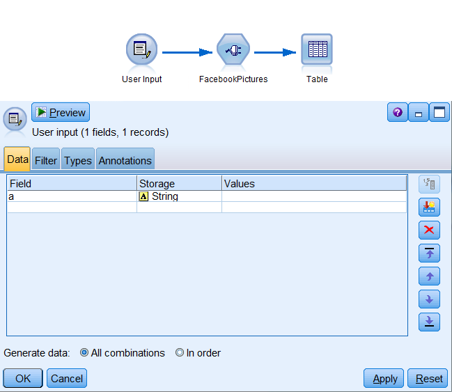

### Import picture URLs from Facebook Page

  

This SPSS Modeler Node allows you to download information about pictures posted by public Facebook Page (such as "IBM"). Information include: direct URL to picture and link to place where picture is from, ID, dates, description and info about album where picture was posted (if any).

### Before you start

_Every action with node requires Facebook Access Token. There are short-lived (2 hours) and long-lived (2 months) Access Tokens._
You can read [Facebook documentation](https://developers.facebook.com/docs/facebook-login/access-tokens/) on access tokens.
To get access token, follow instructions below:

1. Go to https://developers.facebook.com/apps/ and register as developer.

2. Add a new app and go to the Graph API Explorer (link: https://developers.facebook.com/tools/explorer/ ).

3. In "**Application**" choose your app, then in "**Get token**" choose "**Get User Access Token**". In the window select needed User Data Permissions and accept. 

	**Now you have short-lived access token**

4. To get long-lived access token, click on the blue '**i**' and "**Open in Access Token Tool**". There you can click blue button "**Extend Access Token**". Copy your new access token.

	**You received long-lived access token**

### Requirements 

* SPSS Modeler v18.0
* SPSS Modeler "**[R Essentials](https://github.com/IBMPredictiveAnalytics/R_Essentials_Modeler/releases)**" plugin
* R with package "**httr**"

### Example stream

Because the node is not a true source node, a dummy, not empty 'User Input' node has to be connected as input to FacebookPictures node.

  

In the node window you must provide the access token that you received earlier.

You can use ID of any public page. You can find Page ID in url to page (example below).
In example, link to IBM page (which PageID is "**IBM**"): https://web.facebook.com/IBM
You can also use special ID "**me**" to import data about pictures from owner of this access token.

You can type in date information about desired photos. Photo update is any change or addition in photo information (description, backdated date, tags etc.)

At the moment, this node can search photos in all Page albums and comments under each photo.

If searching is too time consuming, you can set "**Max photo amount**" or try other options depending on individual case.

Setting "**Post IDs**" can let you search for photos only in comments under specified posts. You can paste in any Post ID, not only ID of photo from Page album.

  

### Output

The generated output contains:
* unique ID of photo or comment (comment IDs on facebook usually contains '**_**' sign)
* direct URL to photo file
* photo description which is message attached to it (any '**\n**' sign is now "**\<newline>**" - before change it caused the stream run forever)
* photo created date, which is date the photo or post containing the photo was posted first time on facebook
* photo updated date, which is date of the last change of photo information (adding, deleting or changing info like tags, description etc.)
* photo backdated date, which is specified by whom the photo was added (most likely date when photo was taken)
* UserID and UserName are information about person/page who posted the photo
* Parent -ID, -Name, -Description, -CreationDate and -UpdatedDate are information about album (for photo in album) or post (for photo in comment) in which the photo was posted
* IndirectLink provides link to page where you can find this photo (most likely facebook page, but sometimes it can be external page)

  

